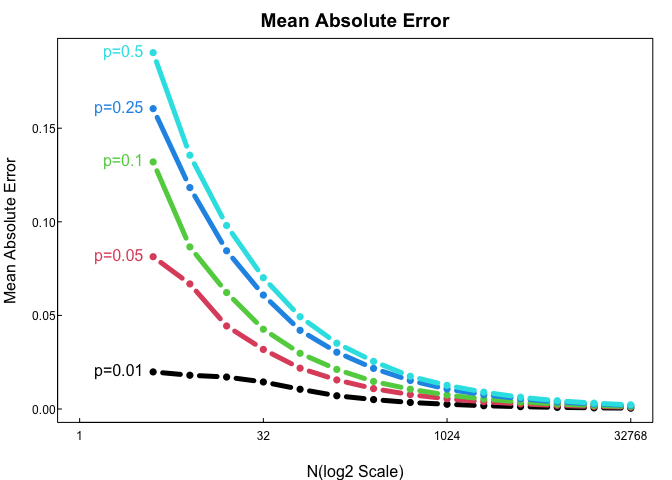
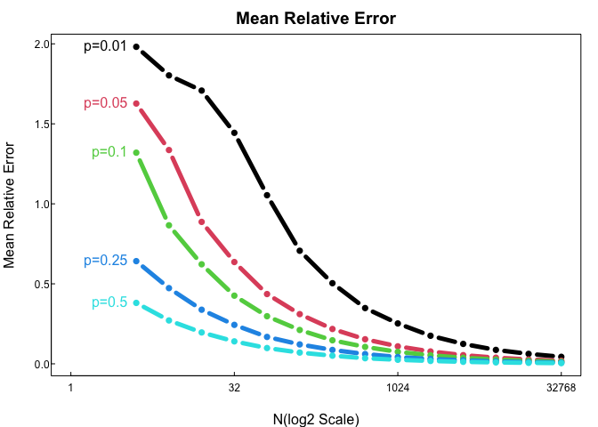
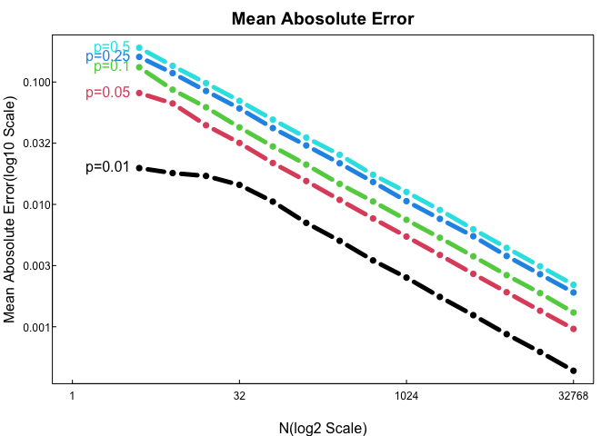
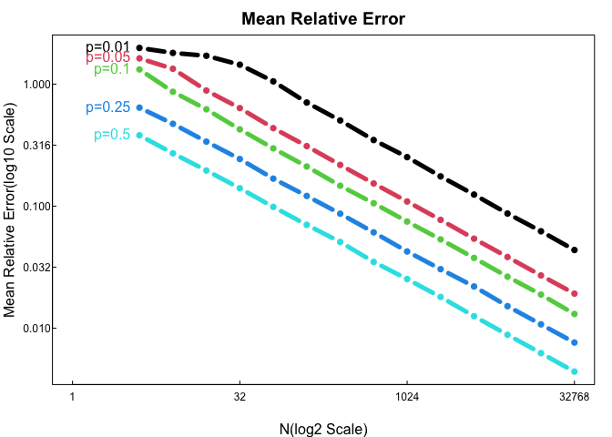

Monte Carlo Error
================
Yiwen Chen
9/12/2021

# Introduction

This blog demonstrates the concepts of absolute error & relative error
in simulation, and relationship between the number of replicates and
those simulation errors. Then, I will explain why the concept is
important, introduce key vocabulary terms, and demonstrate the concept
in action.

## Background

Simulation error there is some degree of error in the number estimated
by the Monte Carlo simulation. Intuitively, as the number of simulation
repetitions increases, the degree of error should decrease.

### Absolute Error

The difference between the measured or inferred value of a quantity and
its actual value is called the absolute error. The absolute error of the
sum or difference of a number of quantities is less than or equal to the
sum of their absolute errors.(Quote from:
<https://mathworld.wolfram.com/AbsoluteError.html#>)

### Relative Error

Relative error is a measure of the uncertainty of measurement compared
to the size of the measurement. It’s used to put error into perspective.
(Quote from:
<https://www.thoughtco.com/definition-of-relative-error-605609>)

# Methods

In this simulation, a 14 X 5 factorial experiment simulation will be
used to estimate the error for each combination of replicate number N =
(2^2, 2^3, …, 2^15) and probability P = (0.01, 0.05, 0.10, 0.25, 0.50).
And then phatI defined a function to estimate probabilities and the
absolute error is \|phat−p\|, the relative error is \|phat−p\|/p. (phat
denotes the probability estimated from simulation, and p denotes the
true underlying probability.)

``` r
library(dtplyr)
library(tidyverse)
```

    ## ── Attaching packages ─────────────────────────────────────── tidyverse 1.3.1 ──

    ## ✓ ggplot2 3.3.5     ✓ purrr   0.3.4
    ## ✓ tibble  3.1.3     ✓ dplyr   1.0.7
    ## ✓ tidyr   1.1.3     ✓ stringr 1.4.0
    ## ✓ readr   2.0.1     ✓ forcats 0.5.1

    ## ── Conflicts ────────────────────────────────────────── tidyverse_conflicts() ──
    ## x dplyr::filter() masks stats::filter()
    ## x dplyr::lag()    masks stats::lag()

``` r
library(magrittr)
```

    ## 
    ## Attaching package: 'magrittr'

    ## The following object is masked from 'package:purrr':
    ## 
    ##     set_names

    ## The following object is masked from 'package:tidyr':
    ## 
    ##     extract

``` r
lwith <- function(l, ...) lapply(l, function(x, ...){with(x, ...)}, ... )
`%|%` <- function(a,b) paste0(a,b)
```

``` r
plot_setup <- function(d, f, xlim = NULL, ylim = NULL, log = "", asp = NA, xaxs = "r", yaxs = "r", ...){
  #browser()
  if(is.null(f)){
    v <- 1:4; dim(v) <- c(2,2)
  }else{
    v <- model.frame(f, data = d) %>% apply(2, range)  
  }
  
  if(is.null(xlim)) xlim <- v[,2]
  if(is.null(ylim)) ylim <- v[,1]
  plot.new()
  par(...)
  plot.window(xlim = xlim, ylim = ylim, log = log, asp = asp, xaxs = xaxs, yaxs = yaxs)
  d
}
```

``` r
plotstyle <- function(data = NULL, style = NULL,...){
  pstl <- deparse(substitute(style))
  
  if(pstl == "NULL"){
    par(
      mar=c(1,1,.1,.1)*2,
      mgp=c(1,0,0),
      tcl=.2,
      cex.axis=.75,
      col.axis="black",
      pch=16
    )
  }else if(pstl == "tight"){
    par(
      mar=c(1,1,.01,.01)*2,
      mgp=c(1,0,0),
      tcl=.2,
      cex.axis=.75,
      col.axis="black"
    )
  }else if(pstl == "upright"){
    par(
      mar=c(1.1,1.1,.1,.1)*2,
      mgp=c(1.1,0.1,0),
      tcl=.2,
      cex.axis=.75,
      col.axis="black",
      pch = 16,
      las = 1
    )
  }
  par(...)
  invisible(data)
}
```

## Parameters and Starting Values

This simulation starts with creating an output grid. Then, I made a for
loop to achieve the whole simulation. The parameters are listed below.

N: replicate numbers for each probability, (2^2, 2^3, …, 2^15);

n: random generated from N;

P: probabilities in each replications, (0.01, 0.05, 0.10, 0.25, 0.50);

p: random generated from P;

phat:random generated based on (r,n,p);

r: times of simulations, 10000;

abs\_error: mean of \|phat - p\|;

rel\_error: mean of \|phat - p\|/p.

``` r
output <- expand.grid(
  N = 2^c(2:15)
, P = c(0.01, 0.05, 0.1, 0.25, 0.5)
, abs_error = NA
, rel_error = NA
, KEEP.OUT.ATTRS = FALSE
)
r <- 10000 
for(i in 1:nrow(output)){
  p <- output$P[i]
  n <- output$N[i]
  phat <- rbinom(r,n,p)/n
  output[i, "abs_error"] <- mean(abs(phat-p))
  output[i, "rel_error"] <- mean(abs(phat-p)/p)
  
}
```

## Simulation with the x-axis on the log2 scale

### Mean Absolute Error with the x-axis on the log2 scale

``` r
output %>%
  mutate(x = log2(N)) %>% 
  mutate(col = as.factor(P) %>% as.numeric)  %>% 
  plot_setup(abs_error ~ x, c(0,15)) %>% 
  plotstyle(upright,mar=c(3,3,2,1)) %>%
  split(.$P) %>% 
  lwith({
    lines(x, abs_error, col = col[1], lwd = 5,type = "b", pch = 16)
    text(x[1],abs_error[1], "p="%|%P[1], pos = 2, col = col[1])
  })
```

    ## $`0.01`
    ## NULL
    ## 
    ## $`0.05`
    ## NULL
    ## 
    ## $`0.1`
    ## NULL
    ## 
    ## $`0.25`
    ## NULL
    ## 
    ## $`0.5`
    ## NULL

``` r
axis(2)
axis(1, at = axTicks(1), labels = 2^axTicks(1))
box()
title(main = "Mean Absolute Error")
title(ylab = "Mean Absolute Error",line = 2)
title(xlab = "N(log2 Scale)", line = 2)
```

<!-- -->

In this picture, Mean Absolute Error, it shows the relationship between
the replicate number and absolute error is negative(x-axis on log2
scale). We can see that as the underlying true probability increases,
the mean absolute error will increase. But as the the replicate number
increases, the mean absolute error will decrease and then approach zero.
And as the the replicate number increases, the average difference
between different true probabilities decrease. In conclusion, the large
the replicate number and more replication is good for finding the true
probability.

### Mean Relative Error with the x-axis on the log2 scale

``` r
output %>% 
  mutate(x = log2(N)) %>% 
  mutate(col = as.factor(P) %>% as.numeric)  %>% 
  plot_setup(rel_error ~ x, c(0,15)) %>% 
  plotstyle(upright,mar=c(3,3,2,1)) %>%
  split(.$P) %>% 
  lwith({
    lines(x, rel_error, col = col[1], lwd = 5,type = "b", pch = 16)
    text(x[1],rel_error[1], "p="%|%P[1], pos = 2, col = col[1])
  })
```

    ## $`0.01`
    ## NULL
    ## 
    ## $`0.05`
    ## NULL
    ## 
    ## $`0.1`
    ## NULL
    ## 
    ## $`0.25`
    ## NULL
    ## 
    ## $`0.5`
    ## NULL

``` r
axis(2)
axis(1, at = axTicks(1), labels = 2^axTicks(1))
box()
title(main = "Mean Relative Error")
title(ylab = "Mean Relative Error",line = 2)
title(xlab = "N(log2 Scale)", line = 2)
```

<!-- -->

In this picture, Mean Relative Error, it shows the relationship between
the replicate number and relative error is negative(x-axis on log2
scale). We can see that as the underlying true probability increases,
the mean relative error will decrease. And as the replicate number
increases, the mean relative error will also decrease and then approach
zero. So, the smaller underlying true probability, the greater impact of
the replicate number increasing on the mean relative error. And we can
get the same conclusion with Mean Absolute error.

## Simulation with the x-axis on the log2 scale and the y-axis on the log10 scale

### Mean Absolute Error with the x-axis on the log2 scale and the y-axis on the log10 scale

``` r
output %>%
  mutate(x = log2(N)) %>% 
  mutate(abs_error = log10(abs_error)) %>% 
  mutate(col = as.factor(P) %>% as.numeric)  %>% 
  plot_setup(abs_error ~ x, c(0,15)) %>% 
  plotstyle(upright,mar=c(3,3,2,1)) %>%
  split(.$P) %>% 
  lwith({
    lines(x, abs_error, col = col[1], lwd = 5,type = "b", pch = 16)
    text(x[1],abs_error[1], "p="%|%P[1], pos = 2, col = col[1])
  })
```

    ## $`0.01`
    ## NULL
    ## 
    ## $`0.05`
    ## NULL
    ## 
    ## $`0.1`
    ## NULL
    ## 
    ## $`0.25`
    ## NULL
    ## 
    ## $`0.5`
    ## NULL

``` r
axis(2, at = axTicks(2), labels = sprintf("%4.3f", 10^axTicks(2)))
axis(1, at = axTicks(1), labels = 2^axTicks(1))
box()
title(main = "Mean Abosolute Error")
title(ylab = "Mean Abosolute Error(log10 Scale)",line = 2)
title(xlab = "N(log2 Scale)", line = 2)
```

<!-- -->

In this picture, we modified the y-axis into log10 scale.(x-axis is
still on log2 scale.) From the output, this figure is very similar to a
negative linear correlation between the replicate number and the mean
absolute error. We can also see that as the underlying true probability
increases, the mean absolute error will increase. But as the the
replicate number increases, the mean absolute error will decrease. And
as the the replicate number increases, the average difference between
different true probabilities decrease. In conclusion, the scale
modification makes the figure easy to show its correlation and reserves
its features.

### Mean Relative Error with the x-axis on the log2 scale and the y-axis on the log10 scale

``` r
output %>%
  mutate(x = log2(N)) %>% 
  mutate(rel_error = log10(rel_error)) %>% 
  mutate(col = as.factor(P) %>% as.numeric)  %>% 
  plot_setup(rel_error ~ x, c(0,15)) %>% 
  plotstyle(upright,mar=c(3,3,2,1)) %>%
  split(.$P) %>% 
  lwith({
    lines(x, rel_error, col = col[1], lwd = 5,type = "b", pch = 16)
    text(x[1],rel_error[1], "p="%|%P[1], pos = 2, col = col[1])
  })
```

    ## $`0.01`
    ## NULL
    ## 
    ## $`0.05`
    ## NULL
    ## 
    ## $`0.1`
    ## NULL
    ## 
    ## $`0.25`
    ## NULL
    ## 
    ## $`0.5`
    ## NULL

``` r
axis(2, at = axTicks(2), labels = sprintf("%4.3f", 10^axTicks(2)))
axis(1, at = axTicks(1), labels = 2^axTicks(1))
box()
title(main = "Mean Relative Error")
title(ylab = "Mean Relative Error(log10 Scale)",line = 2)
title(xlab = "N(log2 Scale)", line = 2)
```

<!-- -->

In this picture, we modified the y-axis into log10 scale.(x-axis is
still on log2 scale.) From the output, this figure is very similar to a
negative linear correlation between the replicate number and the mean
relative error. We can see that as the underlying true probability
increases, the mean relative error will decrease. And as the replicate
number increases, the mean relative error will also decrease. So, the
scale modification makes the figure easy to show its correlation and
reserves its features, too.
