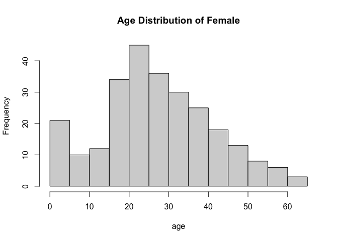
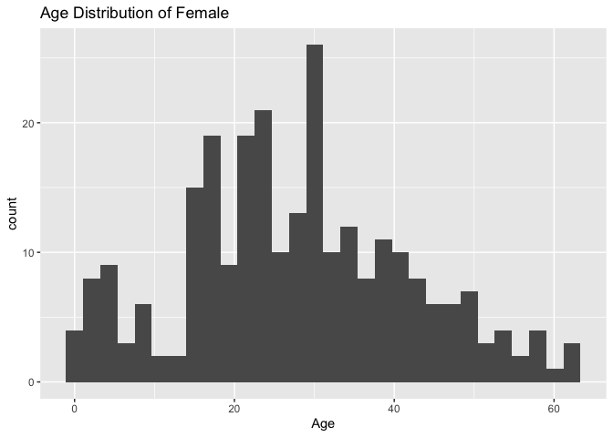
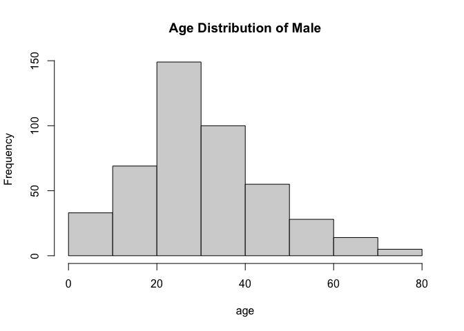
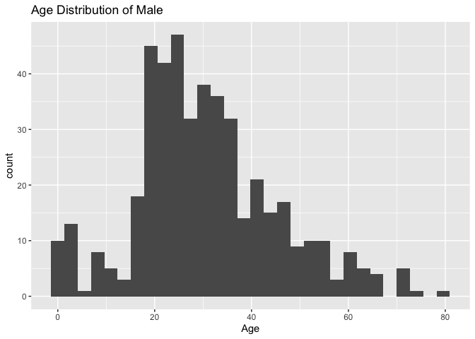

assignment-3
================

``` r
library(tidyverse)
```

    ## ── Attaching packages ─────────────────────────────────────── tidyverse 1.3.1 ──

    ## ✓ ggplot2 3.3.5     ✓ purrr   0.3.4
    ## ✓ tibble  3.1.3     ✓ dplyr   1.0.7
    ## ✓ tidyr   1.1.3     ✓ stringr 1.4.0
    ## ✓ readr   2.0.1     ✓ forcats 0.5.1

    ## ── Conflicts ────────────────────────────────────────── tidyverse_conflicts() ──
    ## x dplyr::filter() masks stats::filter()
    ## x dplyr::lag()    masks stats::lag()

``` r
library(readr) 
library(ggplot2)
library(dplyr)
```

``` r
data<- read.csv('train.csv')
view(data)
```

# 1

Find out the survive vs death ratio with respect to gender.And what’s
the age distribution for each gender.

``` r
data %>% 
  group_by(Sex) %>% 
  summarise(sur_vs_dea_ratio= sum(Survived, na.rm = TRUE)/(n() - sum(Survived,na.rm = TRUE)))
```

    ## # A tibble: 2 × 2
    ##   Sex    sur_vs_dea_ratio
    ##   <chr>             <dbl>
    ## 1 female            2.88 
    ## 2 male              0.233

``` r
data %>% 
  na.omit %>% 
  count(Sex, Age)
```

    ##        Sex   Age  n
    ## 1   female  0.75  2
    ## 2   female  1.00  2
    ## 3   female  2.00  6
    ## 4   female  3.00  2
    ## 5   female  4.00  5
    ## 6   female  5.00  4
    ## 7   female  6.00  2
    ## 8   female  7.00  1
    ## 9   female  8.00  2
    ## 10  female  9.00  4
    ## 11  female 10.00  1
    ## 12  female 11.00  1
    ## 13  female 13.00  2
    ## 14  female 14.00  4
    ## 15  female 14.50  1
    ## 16  female 15.00  4
    ## 17  female 16.00  6
    ## 18  female 17.00  6
    ## 19  female 18.00 13
    ## 20  female 19.00  7
    ## 21  female 20.00  2
    ## 22  female 21.00  7
    ## 23  female 22.00 12
    ## 24  female 23.00  5
    ## 25  female 24.00 16
    ## 26  female 25.00  5
    ## 27  female 26.00  5
    ## 28  female 27.00  6
    ## 29  female 28.00  7
    ## 30  female 29.00  7
    ## 31  female 30.00 11
    ## 32  female 30.50  1
    ## 33  female 31.00  7
    ## 34  female 32.00  3
    ## 35  female 32.50  1
    ## 36  female 33.00  6
    ## 37  female 34.00  4
    ## 38  female 35.00  8
    ## 39  female 36.00  7
    ## 40  female 37.00  1
    ## 41  female 38.00  5
    ## 42  female 39.00  6
    ## 43  female 40.00  6
    ## 44  female 41.00  4
    ## 45  female 42.00  3
    ## 46  female 43.00  2
    ## 47  female 44.00  3
    ## 48  female 45.00  6
    ## 49  female 47.00  2
    ## 50  female 48.00  4
    ## 51  female 49.00  2
    ## 52  female 50.00  5
    ## 53  female 51.00  1
    ## 54  female 52.00  2
    ## 55  female 53.00  1
    ## 56  female 54.00  3
    ## 57  female 55.00  1
    ## 58  female 56.00  1
    ## 59  female 57.00  1
    ## 60  female 58.00  3
    ## 61  female 60.00  1
    ## 62  female 62.00  1
    ## 63  female 63.00  2
    ## 64    male  0.42  1
    ## 65    male  0.67  1
    ## 66    male  0.83  2
    ## 67    male  0.92  1
    ## 68    male  1.00  5
    ## 69    male  2.00  4
    ## 70    male  3.00  4
    ## 71    male  4.00  5
    ## 72    male  6.00  1
    ## 73    male  7.00  2
    ## 74    male  8.00  2
    ## 75    male  9.00  4
    ## 76    male 10.00  1
    ## 77    male 11.00  3
    ## 78    male 12.00  1
    ## 79    male 14.00  2
    ## 80    male 15.00  1
    ## 81    male 16.00 11
    ## 82    male 17.00  7
    ## 83    male 18.00 13
    ## 84    male 19.00 18
    ## 85    male 20.00 13
    ## 86    male 20.50  1
    ## 87    male 21.00 17
    ## 88    male 22.00 15
    ## 89    male 23.00 10
    ## 90    male 23.50  1
    ## 91    male 24.00 14
    ## 92    male 24.50  1
    ## 93    male 25.00 18
    ## 94    male 26.00 13
    ## 95    male 27.00 12
    ## 96    male 28.00 18
    ## 97    male 28.50  2
    ## 98    male 29.00 13
    ## 99    male 30.00 14
    ## 100   male 30.50  1
    ## 101   male 31.00 10
    ## 102   male 32.00 15
    ## 103   male 32.50  1
    ## 104   male 33.00  9
    ## 105   male 34.00 11
    ## 106   male 34.50  1
    ## 107   male 35.00 10
    ## 108   male 36.00 15
    ## 109   male 36.50  1
    ## 110   male 37.00  5
    ## 111   male 38.00  6
    ## 112   male 39.00  8
    ## 113   male 40.00  7
    ## 114   male 40.50  2
    ## 115   male 41.00  2
    ## 116   male 42.00 10
    ## 117   male 43.00  3
    ## 118   male 44.00  6
    ## 119   male 45.00  6
    ## 120   male 45.50  2
    ## 121   male 46.00  3
    ## 122   male 47.00  7
    ## 123   male 48.00  5
    ## 124   male 49.00  4
    ## 125   male 50.00  5
    ## 126   male 51.00  6
    ## 127   male 52.00  4
    ## 128   male 54.00  5
    ## 129   male 55.00  1
    ## 130   male 55.50  1
    ## 131   male 56.00  3
    ## 132   male 57.00  1
    ## 133   male 58.00  2
    ## 134   male 59.00  2
    ## 135   male 60.00  3
    ## 136   male 61.00  3
    ## 137   male 62.00  3
    ## 138   male 64.00  2
    ## 139   male 65.00  3
    ## 140   male 66.00  1
    ## 141   male 70.00  2
    ## 142   male 70.50  1
    ## 143   male 71.00  2
    ## 144   male 74.00  1
    ## 145   male 80.00  1

``` r
f_p<-data %>% 
  na.omit %>% 
  filter(Sex=="female") 
  hist(f_p$Age, xlab = "age", main = "Age Distribution of Female")
```

<!-- -->

``` r
  ggplot(f_p, aes(x= Age)) + geom_histogram(bins = 30) + labs(title = "Age Distribution of Female") 
```

<!-- -->

``` r
m_p<-data %>% 
  na.omit %>% 
  filter(Sex=="male") 
  hist(m_p$Age, xlab = "age", main = "Age Distribution of Male")
```

<!-- -->

``` r
  ggplot(m_p, aes(x= Age)) + geom_histogram(bins = 30) + labs(title = "Age Distribution of Male") 
```

<!-- -->

# 2

What is the mean age with respect to survived.

``` r
data %>% 
  filter(Survived == 1) %>% 
  group_by(Survived) %>% 
  summarise(mean_age = mean(Age,na.rm = TRUE))
```

    ## # A tibble: 1 × 2
    ##   Survived mean_age
    ##      <int>    <dbl>
    ## 1        1     28.3

# 3

hint: count, sort, arrange.

Find the 75% percentile of age with respect to survived column, then add
a new column called age\_bracket. We put major in the age\_bracket if’s
the age is in the 75% percentile and minor for the rest 25% percentile.

``` r
data %>% 
  na.omit %>%
  filter(Survived == 1) %>% 
  count(Survived, Age) %>% 
  arrange(desc(n)) %>% 
  mutate(cumsum_n = cumsum(`n`)) %>% 
  mutate(age_bracket = ifelse(cumsum_n >= 0.75*sum(n),"minor","major"))
```

    ##    Survived   Age  n cumsum_n age_bracket
    ## 1         1 24.00 15       15       major
    ## 2         1 22.00 11       26       major
    ## 3         1 27.00 11       37       major
    ## 4         1 35.00 11       48       major
    ## 5         1 36.00 11       59       major
    ## 6         1 30.00 10       69       major
    ## 7         1 18.00  9       78       major
    ## 8         1 19.00  9       87       major
    ## 9         1 32.00  9       96       major
    ## 10        1 29.00  8      104       major
    ## 11        1 31.00  8      112       major
    ## 12        1  4.00  7      119       major
    ## 13        1 28.00  7      126       major
    ## 14        1 16.00  6      132       major
    ## 15        1 17.00  6      138       major
    ## 16        1 25.00  6      144       major
    ## 17        1 26.00  6      150       major
    ## 18        1 33.00  6      156       major
    ## 19        1 34.00  6      162       major
    ## 20        1 40.00  6      168       major
    ## 21        1 42.00  6      174       major
    ## 22        1 48.00  6      180       major
    ## 23        1  1.00  5      185       major
    ## 24        1  3.00  5      190       major
    ## 25        1 21.00  5      195       major
    ## 26        1 23.00  5      200       major
    ## 27        1 38.00  5      205       major
    ## 28        1 39.00  5      210       major
    ## 29        1 45.00  5      215       major
    ## 30        1 50.00  5      220       minor
    ## 31        1  5.00  4      224       minor
    ## 32        1 15.00  4      228       minor
    ## 33        1 49.00  4      232       minor
    ## 34        1  2.00  3      235       minor
    ## 35        1 14.00  3      238       minor
    ## 36        1 20.00  3      241       minor
    ## 37        1 44.00  3      244       minor
    ## 38        1 52.00  3      247       minor
    ## 39        1 54.00  3      250       minor
    ## 40        1 58.00  3      253       minor
    ## 41        1  0.75  2      255       minor
    ## 42        1  0.83  2      257       minor
    ## 43        1  6.00  2      259       minor
    ## 44        1  8.00  2      261       minor
    ## 45        1  9.00  2      263       minor
    ## 46        1 13.00  2      265       minor
    ## 47        1 41.00  2      267       minor
    ## 48        1 51.00  2      269       minor
    ## 49        1 56.00  2      271       minor
    ## 50        1 60.00  2      273       minor
    ## 51        1 62.00  2      275       minor
    ## 52        1 63.00  2      277       minor
    ## 53        1  0.42  1      278       minor
    ## 54        1  0.67  1      279       minor
    ## 55        1  0.92  1      280       minor
    ## 56        1  7.00  1      281       minor
    ## 57        1 11.00  1      282       minor
    ## 58        1 12.00  1      283       minor
    ## 59        1 32.50  1      284       minor
    ## 60        1 37.00  1      285       minor
    ## 61        1 43.00  1      286       minor
    ## 62        1 47.00  1      287       minor
    ## 63        1 53.00  1      288       minor
    ## 64        1 55.00  1      289       minor
    ## 65        1 80.00  1      290       minor

``` r
data %>% 
  na.omit %>%
  filter(Survived == 0) %>% 
  count(Survived, Age) %>% 
  arrange(desc(n)) %>% 
  mutate(cumsum_n = cumsum(`n`)) %>% 
  mutate(age_bracket = ifelse(cumsum_n >= 0.75*sum(n),"minor","major"))
```

    ##    Survived  Age  n cumsum_n age_bracket
    ## 1         0 21.0 19       19       major
    ## 2         0 28.0 18       37       major
    ## 3         0 18.0 17       54       major
    ## 4         0 25.0 17       71       major
    ## 5         0 19.0 16       87       major
    ## 6         0 22.0 16      103       major
    ## 7         0 24.0 15      118       major
    ## 8         0 30.0 15      133       major
    ## 9         0 20.0 12      145       major
    ## 10        0 26.0 12      157       major
    ## 11        0 29.0 12      169       major
    ## 12        0 16.0 11      180       major
    ## 13        0 36.0 11      191       major
    ## 14        0 23.0 10      201       major
    ## 15        0 31.0  9      210       major
    ## 16        0 32.0  9      219       major
    ## 17        0 33.0  9      228       major
    ## 18        0 34.0  9      237       major
    ## 19        0 39.0  9      246       major
    ## 20        0 47.0  8      254       major
    ## 21        0  2.0  7      261       major
    ## 22        0 17.0  7      268       major
    ## 23        0 27.0  7      275       major
    ## 24        0 35.0  7      282       major
    ## 25        0 40.0  7      289       major
    ## 26        0 42.0  7      296       major
    ## 27        0 45.0  7      303       major
    ## 28        0  9.0  6      309       major
    ## 29        0 38.0  6      315       major
    ## 30        0 44.0  6      321       minor
    ## 31        0 37.0  5      326       minor
    ## 32        0 50.0  5      331       minor
    ## 33        0 51.0  5      336       minor
    ## 34        0 54.0  5      341       minor
    ## 35        0 41.0  4      345       minor
    ## 36        0 43.0  4      349       minor
    ## 37        0  4.0  3      352       minor
    ## 38        0 11.0  3      355       minor
    ## 39        0 14.0  3      358       minor
    ## 40        0 46.0  3      361       minor
    ## 41        0 48.0  3      364       minor
    ## 42        0 52.0  3      367       minor
    ## 43        0 61.0  3      370       minor
    ## 44        0 65.0  3      373       minor
    ## 45        0  1.0  2      375       minor
    ## 46        0  7.0  2      377       minor
    ## 47        0  8.0  2      379       minor
    ## 48        0 10.0  2      381       minor
    ## 49        0 28.5  2      383       minor
    ## 50        0 30.5  2      385       minor
    ## 51        0 40.5  2      387       minor
    ## 52        0 45.5  2      389       minor
    ## 53        0 49.0  2      391       minor
    ## 54        0 56.0  2      393       minor
    ## 55        0 57.0  2      395       minor
    ## 56        0 58.0  2      397       minor
    ## 57        0 59.0  2      399       minor
    ## 58        0 60.0  2      401       minor
    ## 59        0 62.0  2      403       minor
    ## 60        0 64.0  2      405       minor
    ## 61        0 70.0  2      407       minor
    ## 62        0 71.0  2      409       minor
    ## 63        0  3.0  1      410       minor
    ## 64        0  6.0  1      411       minor
    ## 65        0 14.5  1      412       minor
    ## 66        0 15.0  1      413       minor
    ## 67        0 20.5  1      414       minor
    ## 68        0 23.5  1      415       minor
    ## 69        0 24.5  1      416       minor
    ## 70        0 32.5  1      417       minor
    ## 71        0 34.5  1      418       minor
    ## 72        0 36.5  1      419       minor
    ## 73        0 55.0  1      420       minor
    ## 74        0 55.5  1      421       minor
    ## 75        0 66.0  1      422       minor
    ## 76        0 70.5  1      423       minor
    ## 77        0 74.0  1      424       minor

75% percentile of age in (Survived == 1) is 45 years old, and 75%
percentile of age in (Survived == 0) is 38 years old.
